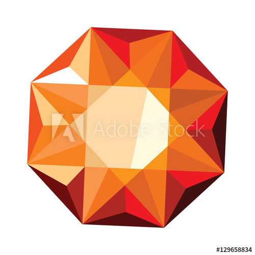
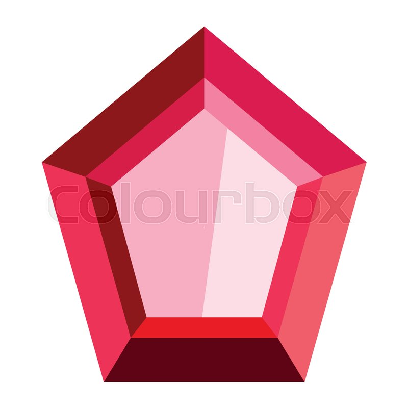
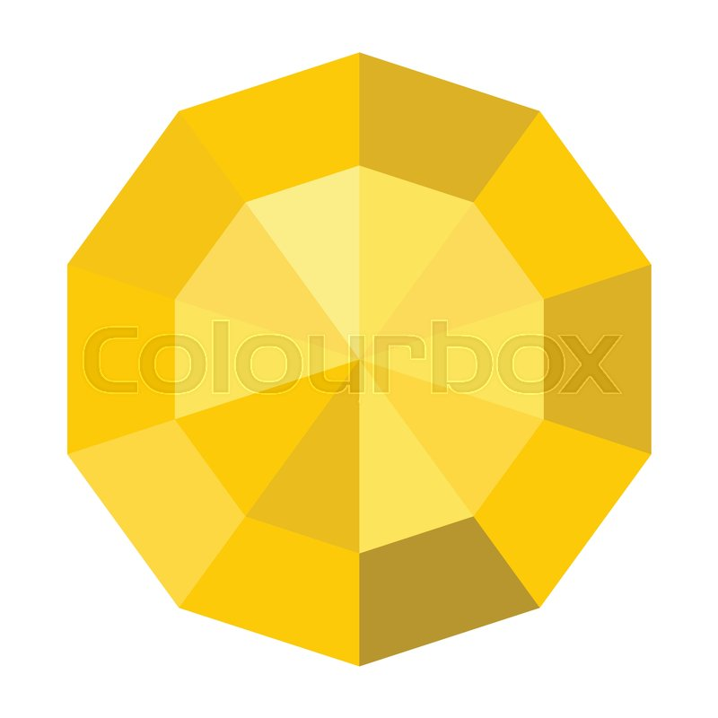

# unit-4-game

Technologies used:
HTML
CSS
Jquery

This assignment has one HTML page, one javascript file, two CSS file and some images:
1. index.html
2. game.js
3. style.css
4. reset.css

In this game the a raondom number is generated from 19-120 and random numbers on crystals between 1-12. The user need to click on the crystals to add the amount of point to meet the exact random number generated by the computer. If the random number matches the number generated by the computer then you win. If you exceed the number computer generated then you lose. 

In index page the following is the body block 
'''
<body>

    <h1>Crystals Collector!</h1>
    

        
You will be given a random number at the start of the game.

         
        
There are four crystals below. By clicking on a crystal you will add a specific amount of points to your total score.

         
        
You win the game by matching your total score to random number, you lose the game if your total score goes above the rando number.

         
        
The value of each crystal is hidden fro you until you click on it.

         
        
Each time when the game starts, the game will change the value of each crystal.

         
    

    

        

        

        

            

           
Wins: 0

           
Losses: 0

           
        

    

    

        
        
        
        
    

    
Your total score is:

    
 0

    
</body>
'''
In javascript file  we have multiple functions in jquery.
'''
// function to create a random number between 19 -120
function scoreToReach(){
   return Math.floor(Math.random() * (102)) + 19;
}
//function to generate rando value between 1-12
function random4Crystals(){
   return Math.floor(Math.random() * (12)) + 1;
}
// The score user needs to reach and was generated by computer using math.random function
 $(".randomNumber").text(scoreToReach());

// This function increment the score when ever a gem is clicked
var sum = 0;
var wins = 0;
var losses = 0;
function incrementScore(){
    sum += parseInt($(this).text());
    $(".scoreCounter").text(sum);

    if(parseInt($(".randomNumber").text()) === sum){
    wins++;
    $(".status").text("You Won!");
    $(".wins").text("Wins: "+ wins);
    setDefaultValues();
    
    }else if(parseInt($(".randomNumber").text()) < sum){
        $(".status").text("You Lost!");
        losses++;
        $(".losses").text("Losses: "+ losses);
        setDefaultValues();
    }
    
}

// Different random numbers generated by computer for each gem
 $("#image1").text(random4Crystals());
 $("#image2").text(random4Crystals());
 $("#image3").text(random4Crystals());
 $("#image4").text(random4Crystals());

//calling the function increment when a particular gem is clicked
$("#image1").on("click", incrementScore);
$("#image2").on("click", incrementScore);
$("#image3").on("click", incrementScore);
$("#image4").on("click", incrementScore);

// function to set different values and make total score to zero

function setDefaultValues(){
    $(".scoreCounter").text("0");
    sum = 0;
    $(".randomNumber").text(scoreToReach());
    $("#image1").text(random4Crystals());
     $("#image2").text(random4Crystals());
     $("#image3").text(random4Crystals());
     $("#image4").text(random4Crystals());
}
'''

screenshot of the page
index.html

![image] (https://github.com/sreeveena/unit-4-game/blob/master/assets/images/game1.png)
